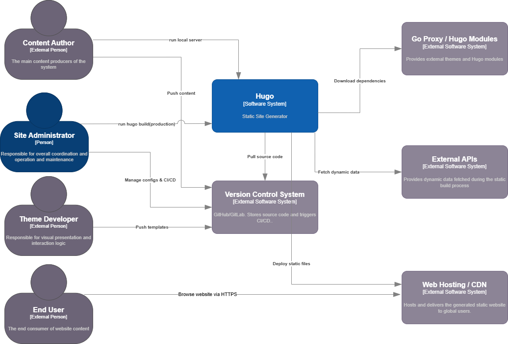
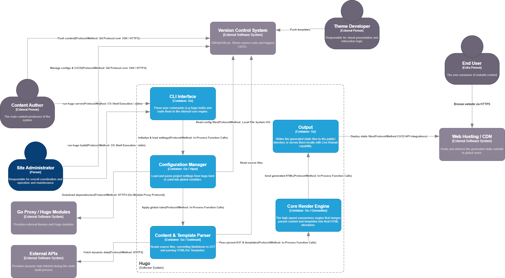
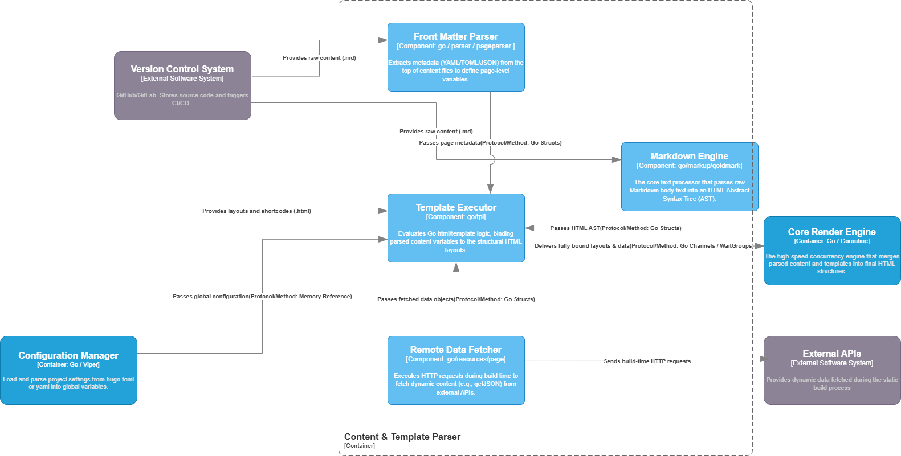

# Hugo — Architecture Report

Diagram tool: draw.io  
Scope: the Hugo static site generator, focusing on the Hugo software system, its main build pipeline, and the internal structure of the Content & Template Parser.

## 1. Context level

### 1.1 Hugo
As a static website generator (SSG), Hugo acts as a high-speed compilation engine. Located at the heart of the ecosystem, it takes content and design resources as input, acquires the necessary remote dependencies, and outputs a fully static, directly deployable website.

### 1.2 Actors and Roles
* **Content Author**: The main content producer of the system. This actor writes Markdown content and can run Hugo locally, for example to start a local server or to push content through the version control workflow.
* **Theme Developer**: Responsible for visual presentation and interaction logic. This actor creates or modifies templates, layouts, CSS, JavaScript, and theme-related resources, then pushes templates to the version control system.
* **Site Administrator**: Responsible for overall coordination, operation, and maintenance. This actor manages configuration, CI/CD settings, and production build or deployment workflows.
* **End User**: The final consumer of the generated website. The end user does not interact directly with Hugo; instead, they browse the static website through the external Web Hosting / CDN system.

### 1.3 External System
* **Version Control System**: GitHub or GitLab-based source hosting. It stores source code and triggers CI/CD workflows. Content authors, theme developers, and site administrators interact with it by pushing content, templates, and configuration.
* **Go Proxy / Hugo Modules**: Provides external themes and Hugo modules. Hugo downloads dependencies from this system during the build or module resolution process.
* **External APIs**: Optional external data providers used during the static build process. Hugo may fetch dynamic data from these APIs when the site configuration or templates require it.
* **Web Hosting / CDN**: Hosts and delivers the generated static website to global users. It receives deployed static files and serves them to end users through HTTPS.

The context diagram highlights that Hugo is a build-time system rather than a production runtime system. After the generated files are deployed, the Web Hosting / CDN is responsible for serving the site.

## 2. Container level

### 2.1 overview
The container diagram zooms into the Hugo software system and shows the main high-level runtime responsibilities inside the generator. Hugo is not a distributed microservice system; it is a monolithic command-line application written in Go. Therefore, the containers in this view represent major logical runtime units inside the Hugo build pipeline rather than independently deployed services.

### 2.2 Core Container
The internal architecture is divided into five core components that form a high-speed compilation pipeline:

* **CLI Interface**: The entry point of the system. It parses user commands such as local server execution and production build commands, then routes them to the internal core engine.
* **Configuration Manager**: Loads and parses project settings from configuration files such as `hugo.toml` or YAML files. It initializes global variables and applies global build rules used by the rest of the pipeline.
* **Content & Template Parser**: Reads source files, converts Markdown into an abstract syntax tree, parses HTML/Go templates, and prepares structured content and layout data for rendering.
* **Core Render Engine**: Combines parsed content and templates into final HTML structures. It represents the high-speed rendering part of the pipeline and relies on Go's concurrency model for efficient generation.
* **Output**: Writes the generated static files into the public directory or serves them locally with live reload during development.

### 2.3 Data Flow and Interactions
The main build flow starts when a Content Author or Site Administrator runs a Hugo command. The **CLI Interface** receives the command and starts the internal pipeline. The **Configuration Manager** reads configuration files from the **Version Control System** or checked-out project workspace and passes global settings to the rest of the system. The **Content & Template Parser** then reads source files and templates, optionally downloads dependencies through **Go Proxy / Hugo Modules**, and may fetch build-time data from **External APIs**.

After parsing, the structured content and templates are passed to the **Core Render Engine**, which generates final HTML structures. The **Output** container then writes the generated site or deploys static files to **Web Hosting / CDN**. In development mode, the Output container can also serve local preview content, which corresponds to the local server workflow shown in the diagram.

This view shows Hugo as a pipeline-oriented modular monolith. Its components are tightly integrated in a single executable, but the diagram separates their responsibilities to make the build lifecycle understandable.

## 3. Component level 

### 3.1 Zooming into the Parser Container
The component diagram zooms into the **Content & Template Parser** container. This container was selected because it represents one of Hugo's most important internal processing areas: it transforms raw website source files into structured content, metadata, templates, and data objects that can later be rendered by the Core Render Engine.

### 3.2 Internal Components

* **Front Matter Parser** (`go / parser / pageparser`): Extracts page metadata from the beginning of content files. It separates YAML, TOML, or JSON front matter from the Markdown body and produces page-level metadata variables.
* **Markdown Engine** (`go / markup / goldmark`): Parses raw Markdown body text into an HTML Abstract Syntax Tree. This component wraps the Goldmark engine and connects Markdown processing with Hugo-specific rendering behavior.
* **Template Executor** (`go / tpl`): Evaluates Go `html/template` logic. It binds metadata, parsed content, fetched data objects, global configuration, layouts, and shortcodes into final structured page layouts.
* **Remote Data Fetcher** (`go / resources / page`): Executes build-time HTTP requests to external APIs when configured. It provides fetched data objects to the Template Executor.

### 3.3 Component data flow

The parsing workflow begins with raw content files. The **Front Matter Parser** extracts page metadata and passes it to the **Template Executor**. The **Markdown Engine** receives the Markdown body and produces an HTML AST, which is also passed to the Template Executor. At the same time, the **Configuration Manager** provides global configuration through memory references, while the **Remote Data Fetcher** may request data from **External APIs** and pass the fetched objects back into the template execution process.

The **Template Executor** is the main assembly point in this component view. It receives page metadata, HTML ASTs, global configuration, fetched data objects, and layouts or shortcodes from the version-controlled project files. It then delivers fully bound layouts and data to the external **Core Render Engine**, which completes the final HTML generation step.

### 3.4 Methodology: container selection

Only the **Content & Template Parser** is expanded in this component diagram to avoid unnecessary diagram complexity. The **CLI Interface** and **Configuration Manager** are mainly coordination and initialization units. The **Core Render Engine** is more related to execution behavior and concurrency than to static structural decomposition. The **Output** container is mainly I/O-oriented. The parser container is therefore the best candidate for a Level 3 structural view because it integrates heterogeneous inputs: Markdown, front matter, templates, global configuration, and optional external data.

## 4. Relationship with Clean Architecture

Hugo is not a strict implementation of the Clean Architecture blueprint. It is primarily a modular monolithic command-line application rather than a layered business application with explicit entity, use case, interface adapter, and framework rings. However, some architectural relationships can still be interpreted using Clean Architecture concepts.

The closest equivalent to the use case layer is the site generation workflow coordinated by the Hugo executable. Commands such as build, serve, module management, and deployment represent application-specific use cases. These use cases are mostly orchestrated by the command layer and the build orchestration logic, which coordinate configuration loading, module resolution, content processing, template rendering, resource transformation, and publishing.

The closest equivalent to the entity or domain layer is Hugo's internal model of pages, sites, resources, taxonomies, menus, languages, and output formats. These concepts represent the core abstractions of a static site generator. They are not business entities in the traditional enterprise sense, but they are the most stable and central concepts of the application domain.

Interface adapters can be recognized in components that translate external input and output formats into Hugo's internal model. The command-line interface adapts user commands into build operations. The configuration loader adapts configuration files into normalized build settings. The markup processor adapts Markdown and other markup formats into renderable content. The publisher adapts generated artifacts into filesystem output or deployment-oriented output.

Frameworks and drivers correspond to infrastructure details such as the local file system, Go modules, Git repositories, external asset processors, the embedded HTTP development server, and deployment platforms. These elements are important for execution, but they should remain details from the perspective of Hugo's core generation logic.

Therefore, Hugo only partially matches Clean Architecture. It shows a recognizable separation between user-facing adapters, build orchestration, core site-generation concepts, and infrastructure details. However, the dependency rule is not enforced strictly across all packages: central packages such as `hugolib` still depend on many concrete infrastructure and helper packages. This is acceptable for Hugo's architectural style, but it means the system should be described as a pragmatic modular monolith rather than as a pure Clean Architecture system.

## 5. SOLID observations at component level

**SRP.** Most top-level packages are cohesive: `markup` changes for content rendering, `resources` for asset processing, `tpl` for templates, `deploy` for deployment, and `watcher/livereload` for development feedback. The main SRP risk is `commands/hugobuilder.go`: it coordinates build, server, profiling, static file sync, rebuild, and live reload concerns. As an application orchestrator this is acceptable, but it is a change hotspot.

**OCP.** Hugo is moderately open to extension through modules, templates, output formats, markup configuration, and asset pipelines. However, adding a new deep build feature or a new core content dimension generally requires modifying `hugolib` and adjacent packages. Therefore OCP is well supported at the user/project level, but only partially at the internal architecture level.

**LSP.** No clear LSP violation was observed at C4 level 3. The use of public interfaces such as site/page abstractions suggests substitutability is considered, but this should be verified with class/interface-level design analysis if needed.

**ISP.** There is a possible ISP risk around large interfaces and broad template-function namespaces: clients may depend on wide APIs even when they use only a subset. The architecture partly mitigates this by organizing template functions into namespaces such as `resources`, `page`, `site`, `strings`, `urls`, and others.

**DIP.** Hugo uses abstractions for pages, sites, filesystems, resources, and rebuild signaling. Still, package dependencies frequently point from central components to concrete helper/config/filesystem packages. DIP is applied selectively, not universally.

## 6. Architectural characteristics and metrics-based reasoning

**Performance and responsiveness.** These are primary drivers. Hugo’s architecture avoids runtime page generation for visitors: it performs all expensive work at build time. The local build pipeline uses caching, resource caches, parallelism, incremental rebuild logic, and fast render behavior. The trade-off is higher internal complexity in the compiler and orchestrator.

**Deployability.** Hugo itself is highly deployable as a single Go binary. The generated website is also easy to deploy because it is static output. Build tags create standard, extended, deploy, and extended/deploy editions without changing the main architectural style.

**Maintainability and evolvability.** Package-level modularity supports maintenance, especially where responsibilities are clear (`markup`, `tpl`, `resources`, `deploy`). The biggest maintenance risk is the centrality of `hugolib` and `hugoBuilder`, which can become change hotspots and accumulate knowledge dependencies.

**Testability.** A modular monolith is easier to test than a distributed system, and Hugo has many package-level tests. However, full behavior often requires integration tests because correctness depends on interactions among configuration, filesystems, content trees, templates, and resources.

**Portability.** The single-binary Go implementation and filesystem-based input/output make Hugo portable across development environments. Optional external tools and CGO-based extended builds reduce portability only for advanced asset-processing use cases.

**Reliability and fault isolation.** For generated sites, reliability is strong because the production artifact is static. During builds, failures in templates, content, external tools, or filesystems can fail the whole build. This is acceptable for a local build tool but would be a limitation for a long-running service.

**Observability.** Hugo includes logging, errors with file context, progress reporting, metrics, and profiling hooks. These mechanisms support developers diagnosing slow builds or broken templates, although they are oriented to CLI diagnostics rather than distributed-service observability.

## 7. Summary
Hugo's architecture is a single-process modular monolith organized around a static-site build pipeline. The diagrams show three levels of abstraction: the context view explains how actors and external systems interact with Hugo; the container view shows the main internal pipeline units; and the component view zooms into the Content & Template Parser. Hugo does not implement Clean Architecture strictly, but it shows a useful separation between command adaptation, configuration, parsing, rendering, output, and infrastructure concerns. This architecture fits a static site generator because it prioritizes build performance, portability, deployment simplicity, and a clear development workflow.

