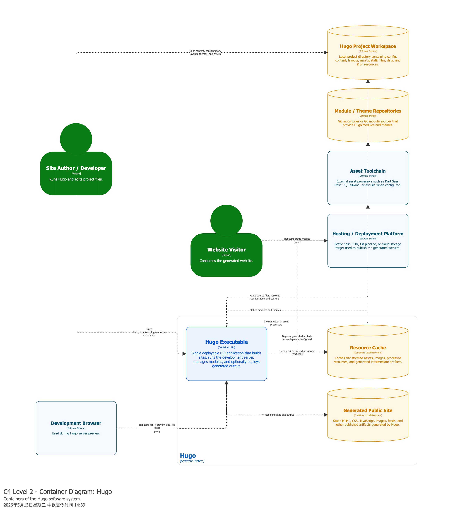

# Hugo — Architecture Report

Report part: Architecture  
Diagram tool: draw.io
Scope: the Hugo static site generator, focusing on the main Hugo CLI binary and its internal package-level components.

## 1. Context level

### 1.1 Hugo
As a static website generator (SSG), Hugo acts as a high-speed compilation engine. Located at the heart of the ecosystem, it takes content and design resources as input, acquires the necessary remote dependencies, and outputs a fully static, directly deployable website.

### 1.2 Actors & Roles
* **Content Actor**:Principal content creator. Focuses on writing Markdown files and providing static media materials.
* **Theme Developer**:They are responsible for visual presentation and user interface logic. They use HTML, CSS, JavaScript, and Go template syntax to build reusable templates.
* **Site Administrator**:Manage global configurations, version control, and CI/CD pipelines to ensure automated builds and deployments.
* **End user**:The end-users of the website. Crucially, the end-users are completely decoupled from the Hugo runtime system. They interact only with external web hosting/CDN, which provides the system with superior security and performance.

### 1.3 External System
**Version System**:(eg:Github) Stores project source files and triggers automated CI/CD builds.
**Web Hosting / CDN**：It delivers infrastructure. It hosts the public/ directory generated by Hugo and distributes it to visitors worldwide.(e.g. Netlify/GitHub Pages)
**External APIs**：Hugo has a unique ability to acquire dynamic data (such as JSON sources and weather statistics) during the build phase, thus enriching static websites with real-time information.
**Go Proxy / Hugo Modules**：Hugo downloads the package management registry of external themes and component dependencies during compilation.

## 2. Container level

At the container level, Hugo is modeled as a single deployable command-line application with a small set of supporting local storage containers. This representation reflects the actual architectural nature of the system: Hugo is not a distributed web application composed of independently deployed services, but a modular monolithic static site generator executed locally by a site author or developer.
The central container is the Hugo Executable. It is the main runtime unit of the system and is implemented in Go. It exposes the command-line interface used to run build, server, module, new-site, and deployment-related commands. Internally, this executable coordinates the complete generation process: it reads project files, loads configuration, resolves content and layouts, processes resources, renders templates, writes the generated website, and optionally starts a local development server.
The Hugo Project Workspace is modeled as an external data store because it is not part of the Hugo executable itself, but it is essential for its operation. It contains the input artifacts of a Hugo site, including configuration files, Markdown content, layouts, assets, static files, data files, i18n resources, and theme-related files. Hugo reads these artifacts during the build process and interprets them as the source model of the website.
Inside the Hugo system boundary, the Resource Cache and the Generated Public Site are represented as local filesystem-based data stores. The Resource Cache stores processed resources such as transformed assets, images, and intermediate build artifacts. This improves build performance and avoids unnecessary repeated processing. The Generated Public Site represents the output of the build process: static HTML, CSS, JavaScript, images, feeds, and other artifacts that can be served by any static hosting platform.
Hugo also interacts with several external systems. Module and Theme Repositories provide reusable Hugo Modules and themes, usually fetched through Git or Go module mechanisms. The Asset Toolchain represents optional external processors such as Dart Sass, PostCSS, Tailwind, or esbuild, which may be invoked when the project configuration requires them. A Development Browser interacts with the Hugo Executable through HTTP when the local development server is running. Finally, a Hosting or Deployment Platform receives the generated static website and serves it to Website Visitors.
This container view shows that Hugo follows a modular monolithic architectural style. Its major responsibilities are packaged into a single executable, while input, cache, and output are separated through filesystem-based data stores. The main communication style is local and synchronous: the user invokes commands, the executable reads and writes files, and optional preview traffic is served over HTTP during development.

## 3. Component level – Hugo CLI binary

The component diagram focuses on the Hugo Executable container, which is the main runtime unit of the system. Since Hugo is distributed as a single command-line application rather than as a set of independently deployed services, the components in this view represent logical source-code and runtime responsibilities inside the executable. The goal of this view is therefore to explain how the main internal subsystems collaborate during site generation, development preview, module resolution, asset processing, and output publishing.
The Command Layer is the entry point for user interaction. It exposes the command-line interface and dispatches commands such as build, server, module management, new site creation, and deployment. This component does not perform the whole build by itself; instead, it coordinates the invocation of lower-level components responsible for configuration loading, dependency preparation, site building, module management, and development serving.
The Configuration Loader is responsible for reading and normalizing the site's configuration. It interprets configuration files, language settings, output formats, mounts, and build options. This component is important because most later build decisions depend on configuration: which content and asset folders are mounted, which themes or modules are enabled, which output formats are required, and how multilingual or multi-output generation should behave.
The Dependency Assembler wires together the runtime services required by the build. It prepares shared dependencies such as file systems, logging, template support, resource services, and configuration-dependent services. This component plays a role similar to an internal composition root: it reduces direct construction dependencies across the rest of the system and centralizes the creation of shared services used by the core build process.
The Site Build Orchestrator is the central component of the Hugo executable. It coordinates the complete site generation workflow: it builds the page model, invokes markup conversion, executes templates, processes resources, and delegates publishing of generated artifacts. This component represents the core application logic of Hugo and is the main coordinator between the domain model, rendering system, asset pipeline, and output publication.
The Content and Page Model component represents Hugo's internal model of pages, sections, taxonomies, menus, multilingual sites, and output formats. It provides the structured data consumed by the rendering and publishing pipeline. The Markup and Shortcode Processor converts source content into renderable page content and evaluates Hugo-specific shortcodes and render hooks. The Template Rendering Engine then applies layouts and template functions to generate final output for pages and other resources.
The Resource and Asset Pipeline handles the transformation of assets such as images, CSS, JavaScript, Sass, and other resources. It may use external tools when configured, for example Sass, PostCSS, Tailwind, or esbuild. To improve performance, transformed resources can be written to the Resource Cache. This separation is architecturally relevant because asset processing is a distinct concern from content rendering, even though both are coordinated during the same build.
The Module and Theme Manager resolves reusable modules and themes from local project files or external repositories. This supports extensibility and reuse by allowing Hugo sites to depend on shared layouts, assets, and configuration fragments. Finally, the Publisher writes the generated website to the output directory and can also support deployment-related workflows. The Development Server is used during local development to serve preview pages, trigger rebuilds, and provide browser-based feedback.
Overall, the component view shows a modular monolithic internal structure. Hugo's components are not independently deployable, but they are separated by responsibilities: command handling, configuration, dependency assembly, site orchestration, content modeling, markup conversion, template rendering, resource processing, module resolution, publishing, and local serving. The main dependency direction flows from the user-facing command layer toward the build orchestration core and then toward specialized processing and output components. This structure supports understandability, extensibility, and performance while keeping the operational model simple as a single executable application.

## 4. Relationship with Clean Architecture

## 5. SOLID observations at component level

## 6. Architectural characteristics and metrics-based reasoning

## 7. Summary
