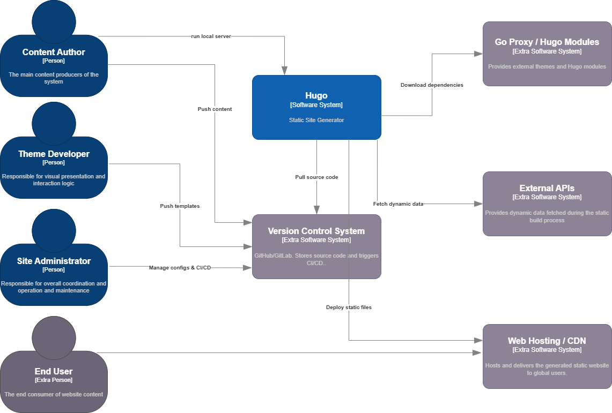
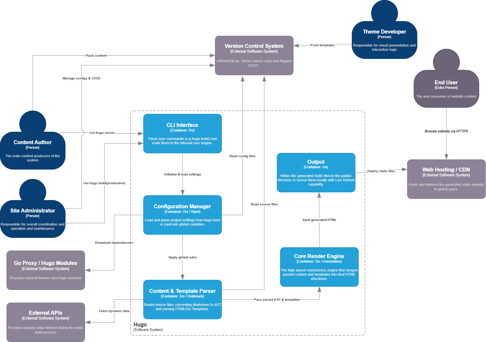

# Hugo — Architecture Report

Report part: Architecture  
Diagram tool: draw.io
Scope: the Hugo static site generator, focusing on the main Hugo CLI binary and its internal package-level components.

## 1. Context level

### 1.1 Hugo
As a static website generator (SSG), Hugo acts as a high-speed compilation engine. Located at the heart of the ecosystem, it takes content and design resources as input, acquires the necessary remote dependencies, and outputs a fully static, directly deployable website.

### 1.2 Actors and Roles
* **Content Creator / Site Maintainer**: Creates Markdown content, provides static media, configures the site, and runs Hugo commands.
* **Theme Developer**: Builds reusable themes and layouts using HTML, CSS, JavaScript, and Hugo's Go template syntax.
* **Site Administrator / DevOps Maintainer**: Manages version control, build automation, deployment configuration, and publishing pipelines.
* **Website Visitor**: Does not interact with Hugo directly. The visitor only consumes the generated static website through an external hosting platform or CDN.

### 1.3 External System
* **Version Control / Source Hosting**: GitHub or another Git-based platform storing the site source, themes, modules, and Hugo source code.
* **Web Hosting / CDN**：It delivers infrastructure. It hosts the public/ directory generated by Hugo and distributes it to visitors worldwide.(e.g. Netlify/GitHub Pages)
* **External Data Sources (optional)**: Optional remote or local data sources that may be used during the build process, depending on the site's configuration and templates.
* **Go Proxy / Hugo Modules**：Hugo downloads the package management registry of external themes and component dependencies during compilation.

## 2. Container level

### 2.1 overview
The container diagram zoomed into show the boundaries of the Hugo system. Unlike traditional web applications, Hugo is a monolithic command-line interface (CLI) application written entirely in Go. Therefore, the "containers" in the diagram do not represent individual microservices or databases, but rather the highest-level logical modules (packages) in the Hugo binary responsible for coordinating the build lifecycle.

### 2.2 Core Container
The internal architecture is divided into five core components that form a high-speed compilation pipeline:
* **CLI Interface**:The entry point of the system. It parses user commands (e.g. hugo build hugo server) and routes them to the appropriate internal engines.
* **Configuration Manager**:Initializes the system by reading and parsing global project settings from hugo.toml or yaml files from the Version Control System.
* **Content & Template Parser**:A dual-purpose module. It reads Markdown files, converting them into an Abstract Syntax Tree (AST) using the Goldmark engine, while simultaneously parsing HTML/Go templates. It is also responsible for fetching dynamic data from External APIs.
* **Core Render Engine**:The core of Hugo's performance. It utilizes Go's powerful concurrency model (Goroutines) to merge parsed content and templates into the final HTML structures at extreme speeds.
* **Output**:It is responsible for the final output. In production mode, it writes static files to the `public/` directory for deployment to a web host/CDN. In development mode, it starts a local server with live reload capabilities.
### 2.3 Data Flow and Interactions
This system employs a highly efficient, one-way build pipeline. The process begins with the user executing a CLI command, which triggers the configuration manager to initialize the system, retrieve settings, and apply global rules. Once initialization is complete, the content and template parsers collect and process all raw input, including Markdown files, layout templates, and dynamic API data. These parsed resources are immediately passed to the core rendering engine, which leverages Go's powerful concurrency to quickly merge the Abstract Syntax Tree (AST) and templates into the final HTML structure. Finally, the output module takes over the remaining work, delivering these fully generated static artifacts directly to an external web hosting infrastructure for global distribution.
## 3. Component level – Hugo CLI binary

The component diagram focuses on the **Hugo Executable** container, which is the main runtime unit of the system. Since Hugo is distributed as a single command-line application rather than as a set of independently deployed services, the components in this view represent logical source-code and runtime responsibilities inside the executable.

The **Command Layer** is the entry point for user interaction. It exposes the command-line interface and dispatches commands such as build, server, module management, new site creation, and deployment. It coordinates lower-level components instead of performing all build work directly. The **Configuration Loader** reads and normalizes configuration files, language settings, output formats, mounts, and build options. The **Dependency Assembler** wires shared runtime services such as file systems, logging, template support, resource services, and configuration-dependent services.

The **Site Build Orchestrator** is the central component of the Hugo executable. It coordinates the complete generation workflow: building the page model, invoking markup conversion, executing templates, processing resources, and delegating publication of generated artifacts. The **Content and Page Model** represents pages, sections, taxonomies, menus, multilingual sites, and output formats. The **Markup and Shortcode Processor** converts source content into renderable page content and evaluates Hugo-specific shortcodes and render hooks. The **Template Rendering Engine** applies layouts and template functions to generate final output.

The **Resource and Asset Pipeline** handles images, CSS, JavaScript, Sass, and other resources. It may use external tools when configured, and it writes transformed resources to the Resource Cache to improve build performance. The **Module and Theme Manager** resolves reusable modules and themes from local files or external repositories. The **Publisher** writes the generated website to the output directory and can support deployment-related workflows. The **Development Server** serves preview pages, triggers rebuilds, and provides browser-based feedback during local development.

Overall, the component view shows a modular monolithic internal structure. Hugo's components are not independently deployable, but they are separated by responsibility: command handling, configuration, dependency assembly, site orchestration, content modeling, markup conversion, template rendering, resource processing, module resolution, publishing, and local serving.

## 4. Relationship with Clean Architecture

Hugo is not a strict implementation of the Clean Architecture blueprint. It is primarily a modular monolithic command-line application rather than a layered business application with explicit entity, use case, interface adapter, and framework rings. However, some architectural relationships can still be interpreted using Clean Architecture concepts.

The closest equivalent to the use case layer is the site generation workflow coordinated by the Hugo executable. Commands such as build, serve, module management, and deployment represent application-specific use cases. These use cases are mostly orchestrated by the command layer and the build orchestration logic, which coordinate configuration loading, module resolution, content processing, template rendering, resource transformation, and publishing.

The closest equivalent to the entity or domain layer is Hugo's internal model of pages, sites, resources, taxonomies, menus, languages, and output formats. These concepts represent the core abstractions of a static site generator. They are not business entities in the traditional enterprise sense, but they are the most stable and central concepts of the application domain.

Interface adapters can be recognized in components that translate external input and output formats into Hugo's internal model. The command-line interface adapts user commands into build operations. The configuration loader adapts configuration files into normalized build settings. The markup processor adapts Markdown and other markup formats into renderable content. The publisher adapts generated artifacts into filesystem output or deployment-oriented output.

Frameworks and drivers correspond to infrastructure details such as the local file system, Go modules, Git repositories, external asset processors, the embedded HTTP development server, and deployment platforms. These elements are important for execution, but they should remain details from the perspective of Hugo's core generation logic.

Therefore, Hugo only partially matches Clean Architecture. It shows a recognizable separation between user-facing adapters, build orchestration, core site-generation concepts, and infrastructure details. However, the dependency rule is not enforced strictly across all packages: central packages such as `hugolib` still depend on many concrete infrastructure and helper packages. This is acceptable for Hugo's architectural style, but it means the system should be described as a pragmatic modular monolith rather than as a pure Clean Architecture system.

## 5. SOLID observations at component level

**SRP.** Most top-level packages are cohesive: `markup` changes for content rendering, `resources` for asset processing, `tpl` for templates, `deploy` for deployment, and `watcher/livereload` for development feedback. The main SRP risk is `commands/hugobuilder.go`: it coordinates build, server, profiling, static file sync, rebuild, and live reload concerns. As an application orchestrator this is acceptable, but it is a change hotspot.

**OCP.** Hugo is moderately open to extension through modules, templates, output formats, markup configuration, and asset pipelines. However, adding a new deep build feature or a new core content dimension generally requires modifying `hugolib` and adjacent packages. Therefore OCP is well supported at the user/project level, but only partially at the internal architecture level.

**LSP.** No clear LSP violation was observed at C4 level 3. The use of public interfaces such as site/page abstractions suggests substitutability is considered, but this should be verified with class/interface-level design analysis if needed.

**ISP.** There is a possible ISP risk around large interfaces and broad template-function namespaces: clients may depend on wide APIs even when they use only a subset. The architecture partly mitigates this by organizing template functions into namespaces such as `resources`, `page`, `site`, `strings`, `urls`, and others.

**DIP.** Hugo uses abstractions for pages, sites, filesystems, resources, and rebuild signaling. Still, package dependencies frequently point from central components to concrete helper/config/filesystem packages. DIP is applied selectively, not universally.

## 6. Architectural characteristics and metrics-based reasoning

**Performance and responsiveness.** These are primary drivers. Hugo’s architecture avoids runtime page generation for visitors: it performs all expensive work at build time. The local build pipeline uses caching, resource caches, parallelism, incremental rebuild logic, and fast render behavior. The trade-off is higher internal complexity in the compiler and orchestrator.

**Deployability.** Hugo itself is highly deployable as a single Go binary. The generated website is also easy to deploy because it is static output. Build tags create standard, extended, deploy, and extended/deploy editions without changing the main architectural style.

**Maintainability and evolvability.** Package-level modularity supports maintenance, especially where responsibilities are clear (`markup`, `tpl`, `resources`, `deploy`). The biggest maintenance risk is the centrality of `hugolib` and `hugoBuilder`, which can become change hotspots and accumulate knowledge dependencies.

**Testability.** A modular monolith is easier to test than a distributed system, and Hugo has many package-level tests. However, full behavior often requires integration tests because correctness depends on interactions among configuration, filesystems, content trees, templates, and resources.

**Portability.** The single-binary Go implementation and filesystem-based input/output make Hugo portable across development environments. Optional external tools and CGO-based extended builds reduce portability only for advanced asset-processing use cases.

**Reliability and fault isolation.** For generated sites, reliability is strong because the production artifact is static. During builds, failures in templates, content, external tools, or filesystems can fail the whole build. This is acceptable for a local build tool but would be a limitation for a long-running service.

**Observability.** Hugo includes logging, errors with file context, progress reporting, metrics, and profiling hooks. These mechanisms support developers diagnosing slow builds or broken templates, although they are oriented to CLI diagnostics rather than distributed-service observability.

## 7. Summary
Hugo’s architecture is a single-process, modular monolith with a strong internal generation pipeline. 
This is appropriate for a static site generator: it prioritizes build performance, portability, operational simplicity, and a rich local developer experience. 
The architecture is not a pure Clean Architecture implementation, but it has a recognizable separation between CLI/adapters, orchestration/use cases, site-generation domain logic, rendering/asset components, and infrastructure details. 
The main architectural risks are the high centrality of `hugolib` and `commands/hugobuilder.go`, which should be monitored for SRP and coupling issues as the project evolves.

