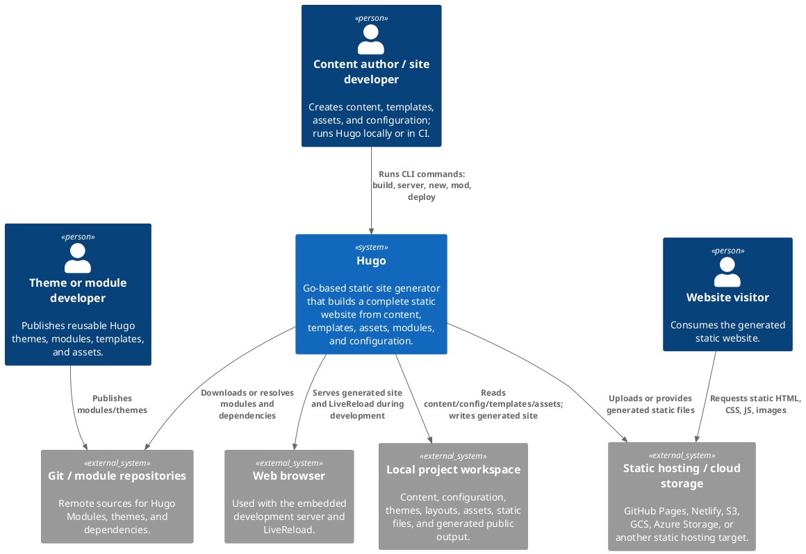
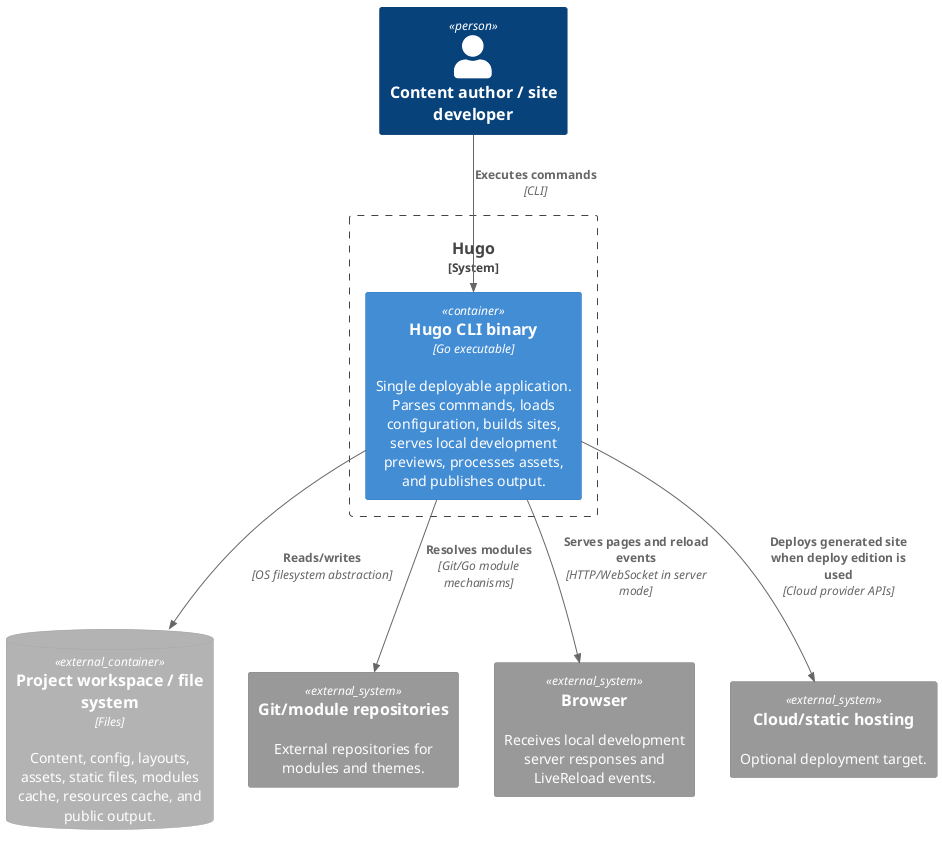
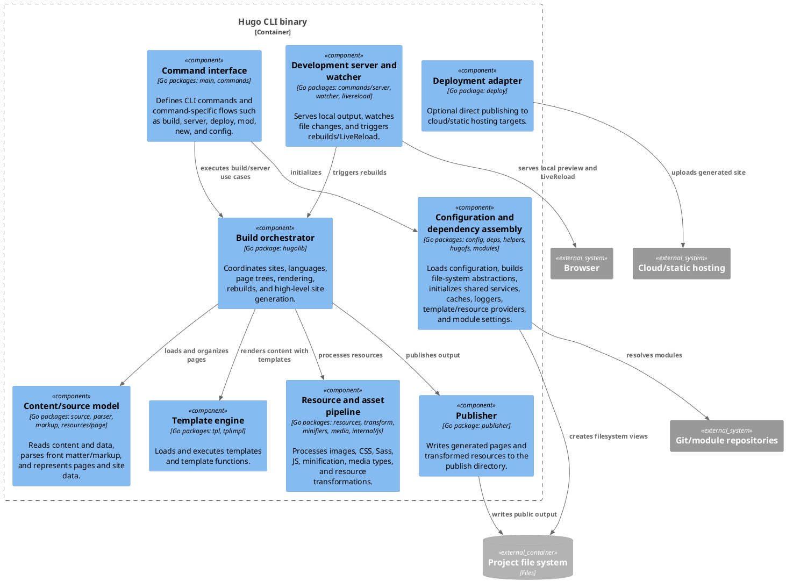

# Software Architecture Report – Hugo

Project repository: https://github.com/SwDA-Team-04/hugo  
Report part: Architecture  
Diagram tool: C4-PlantUML (PlantUML text diagrams embedded below).  
Scope: the Hugo static site generator, focusing on the main Hugo CLI binary and its internal package-level components.

## 1. Context level

At context level, Hugo is a developer-facing build tool rather than an online business service. Its primary stakeholders are content authors/site developers, theme/module developers, and deployment operators. Website visitors normally do not interact with Hugo at runtime; they interact with the static output produced by Hugo. This is important architecturally because most quality concerns concentrate on fast local builds, configurability, extensibility, and correctness of generated files, rather than high availability of a production server.

## 2. Container level

Hugo is best described as a modular monolith packaged as a single Go executable. At C4 container level there is therefore one internal deployable container: the Hugo CLI binary. The project also contains optional behavior controlled by build tags/editions, for example deployment-related features, but these are still compiled into a binary rather than deployed as independent services. The local project workspace, module repositories, browser, and cloud targets are shown as external systems because they are not independently deployable containers owned by Hugo.

This container decision also explains why microservice-specific architectural concerns such as distributed transactions, service discovery, and runtime inter-service consistency are not central in Hugo. Hugo’s main communication style is local call-based interaction within the binary plus file-system state exchange with the project workspace.

## 3. Component level – Hugo CLI binary

The most central component is `hugolib`, which acts as the build orchestrator. It coordinates site/language variants, page trees, rendering, caching, rebuilds, and publishing. The command component is an outer adapter around this core: `main.go` delegates execution to the `commands` package, and the `commands` package wires the individual CLI commands. The `deps` package is an architectural assembly point that collects logger, filesystem, path/content/source specs, resource spec, template store, metrics, and build listeners. `resources` and `publisher` implement the asset/output side of the pipeline.

## 4. Relationship with Clean Architecture

Hugo partially resembles Clean Architecture, but it is not a strict implementation of it.

| Clean Architecture concept | Hugo mapping | Assessment |
|---|---|---|
| Entities / policies | Page/resource/site/configuration concepts, especially packages under `resources/page`, `resources/resource`, `hugolib`, `config` | Hugo has strong domain concepts: page trees, output formats, resources, languages, and site variants. |
| Use cases | Build site, render page, process resource, serve/rebuild, deploy | Use cases are implemented mainly inside `hugolib` and `commands`, not in a clearly isolated application layer. |
| Interface adapters | CLI commands, filesystem abstraction, template adapters, markup converters, publisher | Several adapters exist, and abstractions such as interfaces and filesystem wrappers improve testability. |
| Frameworks/drivers/details | Cobra/simplecobra, Go filesystem libraries, fsnotify, HTTP server, cloud SDKs, image/markup/minification libraries | Details are present at the edges, but some are also imported by central packages. |

The main Clean Architecture mismatch is dependency direction. In a strict Clean Architecture, source-code dependencies should point inward toward higher-level policies. Hugo’s central build packages import many concrete infrastructure/detail packages, including template implementation, publishing, filesystem watching, resource processing, and JavaScript processing. This is understandable for a high-performance static site generator, but it weakens the separation between policy and detail.

## 5. SOLID observations at component level

**SRP risk – build core as a broad orchestrator.** `hugolib.Site` and `hugolib.HugoSites` concentrate multiple reasons to change: language/site variants, page trees, rendering, caching, rebuild state, Git/CODEOWNERS metadata, and progress reporting. This is an acceptable orchestrator pattern in a monolith, but it increases change amplification.

**DIP risk – concrete details imported by central components.** The build core depends on concrete packages such as template implementation, publisher, filesystem events, resource processing, and JavaScript processing. A stricter DIP-oriented design would place more interfaces in the core and move concrete adapters outward.

**ISP risk – large dependency object.** `deps.Deps` works as a dependency assembly object, but it exposes many services and states to consumers. This can make components depend on more than they actually need, which is close to an Interface Segregation Principle smell. Smaller role-specific interfaces could reduce accidental coupling.

**OCP support and limitation.** Hugo is extensible through templates, modules, media types, markup converters, and resource transformations. However, adding a new first-class build concern may still require changes in central orchestration code. This is a common trade-off in a performance-sensitive modular monolith.

## 6. Architectural characteristics and metrics-based reasoning

**Performance.** Performance is a driving characteristic. Hugo’s architecture keeps the build process in one executable and avoids distributed runtime calls. Caches, resource specs, page trees, and parallel build mechanisms support fast generation and rebuilds.

**Configurability and extensibility.** Hugo supports many site shapes through configuration, templates, modules, output formats, languages, and asset pipelines. This is supported by separated packages for configuration, modules, templates, markup, resources, and output.

**Deployability.** Deployability is strong because Hugo is shipped as a single binary. Different editions are compiled with build tags, but deployment is still operationally simple compared with distributed systems.

**Maintainability and testability.** Maintainability is mixed. Package-level separation is visible and the use of interfaces/filesystem abstractions helps testing. However, the centrality of `hugolib` and `deps` creates high coupling hotspots. Suggested metrics to support this claim are: afferent/efferent coupling per Go package, instability `I = Ce / (Ca + Ce)`, number of internal imports, and cycle detection in the package graph.

**Architectural style.** Hugo is a modular monolith with some pipeline-like behavior. It is monolithic because all main behavior is deployed as one binary. It is modular because packages separate CLI, build orchestration, content parsing, template rendering, resource processing, publishing, server/watch mode, and deployment. It is pipeline-like because the typical build flow transforms source content and assets into static output through parsing, rendering, transformation, and publishing stages.

## 7. Summary

Hugo’s architecture is a good fit for its problem domain: a fast, flexible static site generator. The system is not a distributed web application; its architecture optimizes local build performance, configurability, static output generation, and simple deployment. The main architectural trade-off is centralization: `hugolib` and `deps` make orchestration efficient and practical, but they also become coupling hotspots and partially violate Clean Architecture dependency direction and some SOLID principles. For the project report, the most important conclusion is that Hugo should be evaluated as a modular monolith with a build pipeline, not as a microservice or layered enterprise application.
